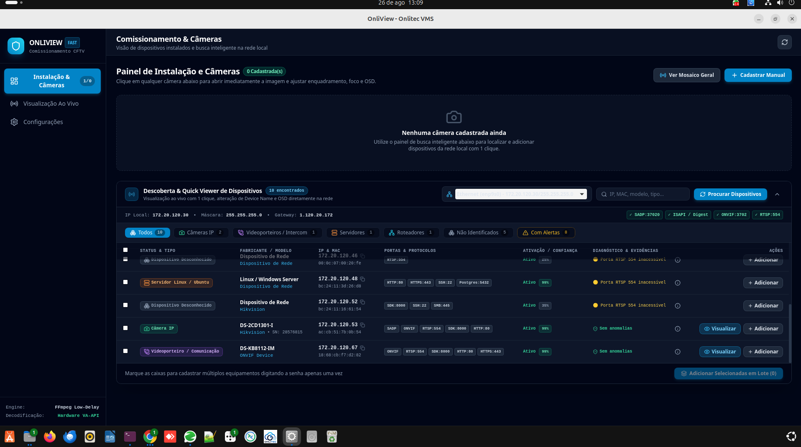

<div align="center">

# 🛡️ ONLIVIEW — Onlitec VMS

**Sistema Profissional de Gerenciamento de Vídeo (VMS) e Comissionamento Rápido de CFTV IP**

[](https://tauri.app)
[](https://www.rust-lang.org)
[](https://react.dev)
[](https://www.typescriptlang.org)
[](https://tailwindcss.com)
[](#-downloads--instalação)
[](#)

---

### *Transformando a Descoberta, Configuração e Monitoramento de Câmeras em uma Experiência Ágil e Moderna.*

</div>

---

## 📸 Interface do OnliView

### Descoberta, Quick Viewer & Comissionamento em Campo
Visualização instantânea do stream ao vivo, telemetria em tempo real (Codec, Resolução, FPS, Latência), diagnóstico de rede e alteração direta de **Device Name** e **OSD** via ISAPI com autenticação Digest:

<div align="center">
  
</div>

---

## 📦 Downloads & Instalação

Baixe a versão mais recente diretamente da aba [Releases](https://github.com/onlitec/OnliCFTV/releases/latest):

### 🪟 Windows (10 / 11 - 64 bits)
| Pacote | Tipo | Descrição |
|---|---|---|
| [**OnliView_0.1.0_x64-setup.exe**](https://github.com/onlitec/OnliCFTV/releases/latest/download/OnliView_0.1.0_x64-setup.exe) | **Instalador Oficial (NSIS)** | Assistente completo com atalhos no Desktop/Menu Iniciar e desinstalador |
| [**OnliView_Windows_Portable.exe**](https://github.com/onlitec/OnliCFTV/releases/latest/download/OnliView_Windows_Portable.exe) | **Executável Portátil** | Execução direta sem necessidade de instalação |

### 🐧 Linux (Ubuntu / Debian / Fedora / RedHat)
| Pacote | Tipo | Comando de Instalação |
|---|---|---|
| [**OnliView_0.1.0_amd64.deb**](https://github.com/onlitec/OnliCFTV/releases/latest/download/OnliView_0.1.0_amd64.deb) | Pacote Debian/Ubuntu | `sudo dpkg -i OnliView_0.1.0_amd64.deb` |
| [**OnliView_0.1.0_amd64.AppImage**](https://github.com/onlitec/OnliCFTV/releases/latest/download/OnliView_0.1.0_amd64.AppImage) | Universal Linux | `chmod +x OnliView_0.1.0_amd64.AppImage && ./OnliView_0.1.0_amd64.AppImage` |
| [**OnliView-0.1.0-1.x86_64.rpm**](https://github.com/onlitec/OnliCFTV/releases/latest/download/OnliView-0.1.0-1.x86_64.rpm) | Pacote Fedora/RHEL | `sudo rpm -i OnliView-0.1.0-1.x86_64.rpm` |

---

## ⚡ Principais Recursos

### 🔍 Descoberta Multicamada Inteligente
- **Protocolos Simultâneos**: Sondagem em paralelo via **SADP Hikvision** (UDP 37020), **ONVIF WS-Discovery** (UDP 3702), **ARP OUI** e varredura TCP em 2 camadas com semáforo bounded de 48 workers.
- **Classificação Multidimensional**: Pontuação de evidências por fabricante, portas e perfil de mídia, separando câmeras reais de falsos positivos (ex: Servidores Linux e Switches de rede).
- **Detecção de Ativação**: Identifica dispositivos que necessitam de ativação de senha inicial.

### 👁 Device Preview & Miniaturas ao Vivo
- **Preview Sob Demanda**: Economiza banda e CPU iniciando streams somente quando solicitado.
- **Autenticação In-Cell**: Solicitação de senha limpa e segura diretamente na célula da tabela.
- **Controle de Concorrência**: Modo *Preview Automático* configurável com limite de 1 a 6 fluxos concorrentes.
- **1-Click Quick Viewer**: Clicar na miniatura abre instantaneamente a visualização completa.

### 🛠 Quick Viewer & Gestão em Campo
- **Visualização RTSP Low-Delay**: Decodificação assíncrona integrada servida via servidor local MJPEG na porta `18554`.
- **Autenticação Digest & Basic**: Suporte completo ao padrão RFC 2617/7616 MD5 com gerenciamento stateful de nonce.
- **Configuração de Device Name & OSD**: Gravação direta no firmware de câmeras Hikvision via ISAPI sem necessidade de abrir navegador Web.
- **Captura de Snapshot & Tela Cheia**: Ferramentas de alinhamento de foco e enquadramento.

### 🎨 Design Dual Theme (White & Dark)
- **Tema Claro (HiTools Delivery Style)**: Interface limpa com tons de branco, cinza técnico e botões em azul vibrante.
- **Tema Escuro Moderno**: Visual Dark projetado para salas de monitoramento e NOC.
- **Alternância Instantânea**: Botão de 1 clique no cabeçalho com persistência em `localStorage`.

### 🔐 Segurança & Performance
- Criptografia forte **AES-256-GCM** para credenciais salvas no banco SQLite local.
- Proteção contra logs vazando senhas de técnicos ou credenciais de dispositivos.
- Zero dependência de plugins ActiveX, WebComponents ou navegadores legados.

---

## 🏗 Arquitetura do Sistema

```
[ Frontend: React 18 + Tailwind + Vite ]
   │
   ├── [ Contexto de Tema: Light (HiTools) / Dark ]
   ├── [ Tabela de Comissionamento de Alta Densidade ]
   ├── [ Célula de Preview / Thumbnails Sob Demanda ]
   └── [ Quick Viewer Modal com Live Stream e Ajuste OSD ]
   │
   ▼ IPC (Tauri v2 Commands)
[ Backend: Rust Nativo ]
   │
   ├── discovery/       -> Varredura SADP, ONVIF, ARP e Classificador de Dispositivos
   ├── camera/isapi.rs  -> Cliente ISAPI com Digest Auth stateful, Device Name e OSD
   ├── video/engine.rs  -> Motor FFmpeg Low-Delay e Servidor Axum HTTP (18554)
   ├── rtsp/probe.rs    -> Telemetria em tempo real (ffprobe, FPS, Resolução)
   └── database/        -> SQLite embutido com criptografia AES-256-GCM
```

---

## 💻 Como Executar Localmente (Desenvolvimento)

### Pré-requisitos
- **Node.js**: v18+ ou v20+
- **pnpm**: `npm install -g pnpm`
- **Rust**: `curl --proto '=https' --tlsv1.2 -sSf https://sh.rustup.rs | sh`
- **FFmpeg & ffprobe**: Instalados no sistema

### Instalação e Execução
```bash
# 1. Clonar o repositório
git clone https://github.com/onlitec/OnliCFTV.git
cd OnliCFTV

# 2. Instalar dependências do frontend
pnpm install

# 3. Iniciar em modo de desenvolvimento
pnpm tauri dev
```

### Compilar Pacotes de Produção
```bash
# Build para Linux (.deb, .AppImage, .rpm)
pnpm tauri build

# Cross-compilação para Windows (.exe instalador NSIS)
pnpm tauri build --target x86_64-pc-windows-gnu
```

---

<div align="center">

Desenvolvido com excelência técnica por **Onlitec** • 2026

</div>
